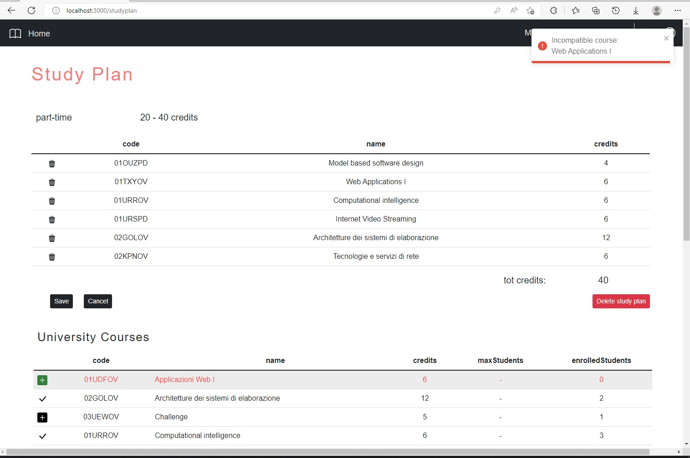

# Exam #1: "Study Plan"
## Student: s301132 ZAMPARUTTI ALESSANDRO 

## **React Client Application Routes**

- Route `/home`: main page (not protected from unauthenticated users) that contains a table with all courses that the university offers.
- Route `/studyplan`: shows the study plan of  (authenticated and authorized) users and allows them to modify it. If the user does not have a study plan a new one can be created.
- Route `/login` shows the form to fill in to authenticate (create a session).


## **API Server**

- **GET** `/api/courses`
  - Get list of courses that the university offers
  - Request body: _None_
  - Response: `200 OK` (success) or `500 Internal Server Error` (generic error).
  - Response body: 
    ```
    [
      {
        "code" : "01SQLOV",
        "name" : "Database systems",
        "credits" : 8,
        "enrolledStudents" : 1,
        "maxStudents" : 3,
        "incompatibleCourses" : [{"code": "01SQJOV"}, {"code": "01SQMOV"}],
        "preparatoryCourse" : null
      },
      {
        "code": "01TXSOV",
        "name": "Web Applications II",
        "credits": 6,
        "enrolledStudents" : 1,
        "maxStudents": null,
        "incompatibleCourses": [],
        "preparatoryCourse": "01TXYOV"
      },
      ...  
    ]
    ```
- **GET** `/api/studyplan`
  - Get study plan of the user
  - Request body: _None_
  - Response: `200 OK` (success), `401 Unauthorized` (not logged in), `404 Not Found` (no study plan found for the user) or `500 Internal Server Error` (generic error).
  - Response body:
    ```
    {
        "type" : "part-time",
        "courses": [ { "code": "01SQLOV" }, { "code": "01TXSOV" }, ... ]
    }
    ```

- **POST** `/api/studyplan`
  - Create new study plan for the user
  - Request body: 
    ```
    {
        "type" : "part-time",
        "courses": [ { "code": "01SQLOV" }, { "code": "01TXSOV" }, ... ]
    }
    ```
  - Response: `201 Created` (success), `401 Unauthorized` (not logged in), `422 Unprocessable Entity` (validation of request body failed or courses constraints failed or total number of credits of the courses in the study plan exceed the credits limit of the type of the study plan) or `503 Service Unavailable` (generic error).
  - Response body: _None_

- **PUT** `/api/studyplan`
  - Modify existent study plan of the user
  - Request body: 
    ```
    {
        "type" : "full-time",
        "courses": [ { "code": "01SQLOV" }, { "code": "01TXSOV" }, ... ]
    }
    ```
  - Response: `200 OK` (success), `401 Unauthorized` (not logged in), `404 Not Found` (no study plan found for the user) or `422 Unprocessable Entity` (validation of request body failed or courses constrains failed or total number of credits of the curses in the study plan exceed the credits limit of the type of th study plan) or `503 Service Unavailable` (generic error).
  - Response body: _None_

- **DELETE** `/api/studyplan`
  - Delete existent study plan of the user
  - Request body: _None_
  - Response: `204 No Content` (success), `401 Unauthorized` (not logged in) or `503 Service Unavailable` (generic error).

  - Response body: _None_

- **POST** `/api/sessions`
  - Create new session
  - Request body:
    ```
    {
      "username": "student@studenti.polito.it",
      "password": "password"
    }
    ```
  - Response: `201 Created` (success) or `500 Internal Server Error` (generic error).
  - Response body: _None_

- **GET** `/api/sessions/current`
  - get current valid session
  - Request body: _None_ 
  - Response: `200 OK` (success), `401 Unauthorized` (not logged in) or `500 Internal Server Error` (generic error).

  - Response body:
    ```
    {
      "username": "student@studenti.polito.it",
      "id": "1",
      "name": "Max",
      "surname": "Power"
    }
    ```
- **DELETE** `/api/sessions/current`
  - Delete current session
  - Request body: _None_
  - Response: `200 OK` (success) or `503 Service Unavailable` (generic error).
  - Response body: _None_


## **Database Tables**

- Table `Users` - contains id, name, surname, email, password (hashed), salt of the users (email, password and salt are used for authenticatication).
- Table `Courses` - contains code, name, credits, enrolledStudents, maxStudents (NULL when unlimited) and preparatoryCourseCode (NULL when nonexistent) of each course.
- Table `IncompatibleCourses` contains courseCode and incompatibleCourseCode (given a courseCode there is a row for each incompatible course of that specific course).
- Table `StudyPlans` contains id (of the study plan), type (full-time or part-time) and userId of each study plan
- Table `StudyPlanCourses` contains studyPlanId and courseCode (given one study plan id there is one row for each course added to it)

## **Main React Components**

- `DefaultLayout` (in `./layout/PageLayout.js`): Default layout always displayed for all Route except for '/login'.
- `HomeLayout` (in `./layout/PageLayout.js`): Layout of the Route '/home', fetches list of courses from the server.
- `CourseTable` (in `./components/CourseComponents.js`): displays the course table, given the list of courses. When a StudyPlan also exists (in the edit Route '/studyplan'), it displays the buttons for adding a course to a study plan.
- `CourseRow` (in `./components/CourseComponents.js`): displays the course row, contains the logic of the expanded/contracted row.
- `CourseInfo` (in `./components/CourseComponents.js`): displays the info about the preparatory course and the incompatible courses when a row is expanded.
- `LoginLayout` (in `./layout/PageLayout.js`): Layout of the Route '/login'. When unauthorized users try to enter in the Route '/studyplan', they are automatically redirected to the login route.
- `LoginForm` (in `./components/LoginComponents.js`): displays the form and handle the login.
- `StudyPlanLayout` (in `./layout/PageLayout.js`): Layout of the Route '/studyplan', protected from unathorized users. fetches the study plan from the server.
- `StudyPlanPage` (in `./components/StudyPlanComponents.js`): displays the study plan of the user and allow them to create / edit / delete it.
- `FormNewStudyPlan` (in `./components/StudyPlanComponents.js`): displays a form when an user wants to create a new study plan.
- `NavBar` (in `/components/NavBarComponents.js`): displays the navbar that contains the links to all the route of the application (Home links to '/home', MyStudyPlan links to '/studyplan', login links to '/login', Contact moves the focus of the page on the footer). When an user is logged in, allows them to logout.


## **Screenshot**



## **Users Credentials**

- username: `student1@studenti.polito.it`, password: `password`
- username: `student2@studenti.polito.it`, password: `testpassword`
- username: `student3@studenti.polito.it`, password: `password`
- username: `student4@studenti.polito.it`, password: `password4`
- username: `student5@studenti.polito.it`, password: `password5`

#### **Study plan info**

- `student1@studenti.polito.it` has a study plan `part-time`
- `student2@studenti.polito.it` has a study plan `full-time`
- `student3@studenti.polito.it` does not have a study plan
- `student4@studenti.polito.it` has a study plan `full-time`
- `student5@studenti.polito.it` does not have a study plan

#### **Course info**

- Course `Web Application I` has reached the maximum number of enrolled students
- Course `Internet Video Streaming` has reached the maximum number of enrolled students
